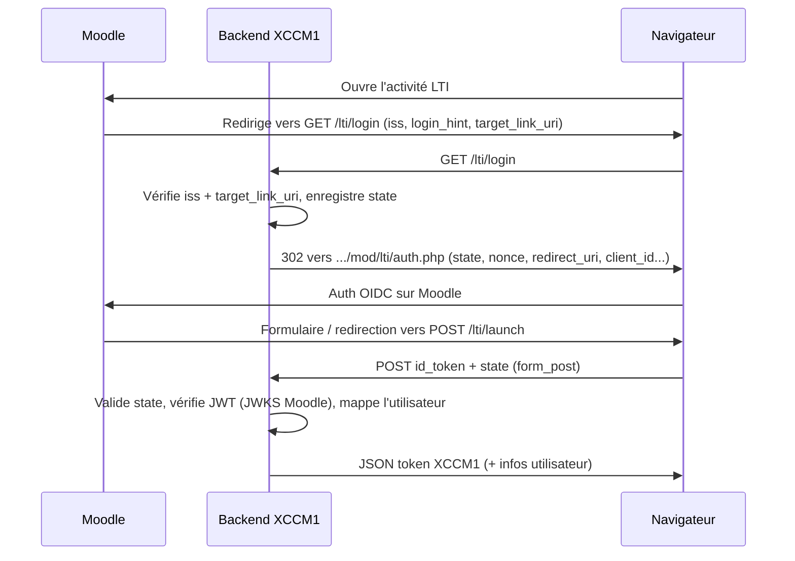

# LTI 1.3 — Fonctionnement, intégration Moodle et tests (curl)

Ce guide explique **comment LTI 1.3 fonctionne** dans ce projet, **comment configurer Moodle et XCCM1**, et **comment tester pas à pas** avec `curl`. Pour les détails techniques déjà rédigés (implémentation, SSO, CSP), voir aussi [`backend-lti-docs.md`](./backend-lti-docs.md). Pour un **rapport de tests sans Moodle** et une **fiche détaillée des paramètres de chaque endpoint**, voir [`lti-tests-et-endpoints.md`](./lti-tests-et-endpoints.md).

---

## 1. Rôles : plateforme et outil

- **Plateforme (LMS)** : ici **Moodle**. Elle connaît les utilisateurs et **signe** le jeton d’identité (`id_token`) avec sa clé privée.
- **Outil (Tool)** : ici **XCCM1** (ce backend). Il est affiché dans Moodle (souvent en iframe) et doit **vérifier** le `id_token` grâce au **JWKS public** de Moodle, puis créer / lier un compte et émettre un **JWT applicatif XCCM1**.

Le standard utilisé est **LTI 1.3 avec OpenID Connect (OIDC)** : pas de mot de passe échangé entre Moodle et l’outil ; c’est un flux de confiance basé sur des JWT et des redirections contrôlées.

---

## 2. Flux résumé (Moodle → XCCM1)



1. **Initiation** : Moodle appelle **`GET /lti/login`** avec notamment `iss` (URL de Moodle), `login_hint` et `target_link_uri`.
2. **Contrôle** : XCCM1 vérifie que `iss` correspond à `lti.moodle.platform-url` et que `target_link_uri` correspond à **`{lti.xccm1.issuer}/lti/launch`**.
3. **Redirection** : XCCM1 répond **302** vers `https://<moodle>/mod/lti/auth.php` avec `state`, `nonce`, `redirect_uri`, `client_id`, etc.
4. **Retour** : Après authentification côté Moodle, le navigateur envoie un **`POST /lti/launch`** avec `id_token` (JWT) et `state`.
5. **Validation** : signature RSA du `id_token` via **`lti.moodle.jwks-url`**, claims LTI, puis **JWT XCCM1** en réponse.

---

## 3. Endpoints XCCM1 côté outil

| Méthode | Chemin | Description |
|--------|--------|-------------|
| `GET` | `/lti/login` | OIDC login initiation (redirection vers Moodle). |
| `POST` | `/lti/launch` | Réception `id_token` + `state` (corps formulaire). |
| `GET` | `/lti/.well-known/jwks.json` | JWKS public de l’outil (pour configuration avancée côté Moodle). |

Ces routes sont **publiques** (pas d’en-tête `Authorization` JWT XCCM1 requis).

---

## 4. Configuration backend (`application.properties` / env)

Valeurs et variables d’environnement courantes :

| Propriété | Variable env (exemple) | Rôle |
|-----------|------------------------|------|
| `lti.moodle.platform-url` | `LTI_MOODLE_PLATFORM_URL` | URL de base de Moodle (sans slash final de préférence). Doit correspondre au paramètre **`iss`** dans `/lti/login`. |
| `lti.moodle.jwks-url` | `LTI_MOODLE_JWKS_URL` | JWKS Moodle, ex. `.../mod/lti/certs.php`. |
| `lti.moodle.client-id` | `LTI_MOODLE_CLIENT_ID` | **Client ID** de l’outil tel qu’enregistré dans Moodle (identique des deux côtés). |
| `lti.xccm1.issuer` | `LTI_XCCM1_ISSUER` | URL **publique** du backend telle que vue par Moodle et le navigateur (schéma + hôte + port). Sert à construire `redirect_uri = {issuer}/lti/launch`. |
| `lti.security.frame-ancestors` | `LTI_SECURITY_FRAME_ANCESTORS` | CSP : autoriser l’iframe depuis Moodle (`self https://moodle.example.org`). |
| `server.port` | `PORT` | Port HTTP du backend (défaut **8080** dans ce dépôt). |

**Important :** Si le backend est derrière un reverse proxy, `lti.xccm1.issuer` doit refléter **l’URL externe** (HTTPS, bon host), pas seulement localhost.

---

## 5. Configuration Moodle (checklist outil LTI 1.3)

À renseigner dans l’outil LTI côté Moodle (libellés peuvent varier selon la version) :

- **Target link URL** (URL de lancement) : `{LTI_XCCM1_ISSUER}/lti/launch`
- **OpenID Connect / Initiate login URL** : `{LTI_XCCM1_ISSUER}/lti/login`
- **Redirection URI(s)** : `{LTI_XCCM1_ISSUER}/lti/launch` (doit correspondre exactement à ce que le backend attend pour `target_link_uri`)
- **Client ID** : identique à `lti.moodle.client-id`
- **Public keyset (JWKS) URL** de l’outil (si Moodle le demande) : `{LTI_XCCM1_ISSUER}/lti/.well-known/jwks.json`
- Déploiement activé pour le cours / activité concernée.

Moodle doit être joignable depuis le backend pour **télécharger le JWKS** (`lti.moodle.jwks-url`).

---

## 6. Tests avec `curl`

Adaptez **hôtes et ports** à votre machine. Exemples ci‑dessous :

- Backend : `http://localhost:8080` → `ISSUER=http://localhost:8080`
- Moodle : `http://localhost:8081` → `MOODLE=http://localhost:8081`

Export recommandé :

```bash
export ISSUER="${LTI_XCCM1_ISSUER:-http://localhost:8080}"
export MOODLE="${LTI_MOODLE_PLATFORM_URL:-http://localhost:8081}"
```

### 6.1 JWKS de l’outil

```bash
curl -sS "${ISSUER}/lti/.well-known/jwks.json" | jq .
```

Attendu : JSON avec une clé `"keys"` (tableau JWK).

### 6.2 Initiation login (`GET /lti/login`)

Les trois paramètres sont attendus : `iss`, `login_hint`, `target_link_uri`.  
`iss` doit être la **même base** que `lti.moodle.platform-url`.  
`target_link_uri` doit être **`${ISSUER}/lti/launch`** (sans query, ou query ignorée pour la validation).

Afficher les en-têtes pour voir la **302** et l’URL Moodle :

```bash
curl -sS -D - -o /dev/null -G "${ISSUER}/lti/login" \
  --data-urlencode "iss=${MOODLE}" \
  --data-urlencode "login_hint=2" \
  --data-urlencode "target_link_uri=${ISSUER}/lti/launch"
```

Vous devez voir une ligne du type :

```http
Location: http://localhost:8081/mod/lti/auth.php?response_type=id_token&...&state=...&...
```

**Erreurs fréquentes :**

- **400** : `iss` ne correspond pas à la config, ou `target_link_uri` ne vaut pas `{issuer}/lti/launch`.

### 6.3 Extraire le `state` (pour la suite du flux)

Avec `grep` / `sed` (le `state` est dans la query de `Location`) :

```bash
HDRS=$(mktemp)
curl -sS -D "$HDRS" -o /dev/null -G "${ISSUER}/lti/login" \
  --data-urlencode "iss=${MOODLE}" \
  --data-urlencode "login_hint=2" \
  --data-urlencode "target_link_uri=${ISSUER}/lti/launch"

LOCATION=$(grep -i '^Location:' "$HDRS" | tr -d '\r' | sed 's/^[Ll]ocation: //')
STATE=$(printf '%s' "$LOCATION" | sed -n 's/.*[\?&]state=\([^&]*\).*/\1/p' | sed 's/%3D/=/g;s/%2B/+/g' | python3 -c "import sys,urllib.parse; print(urllib.parse.unquote(sys.stdin.read().strip()))" 2>/dev/null || true)
echo "Location: $LOCATION"
echo "state: $STATE"
rm -f "$HDRS"
```

Le `state` ainsi obtenu est celui **enregistré côté XCCM1** : il doit être renvoyé **tel quel** dans le `POST /lti/launch` avec le `id_token` émis par Moodle.

### 6.4 Lancement (`POST /lti/launch`) — bout en bout réel

**On ne peut pas produire un `id_token` valide uniquement avec `curl` sans Moodle** : le JWT doit être **signé par Moodle** avec les claims attendus (audience, issuer, expiration, claims LTI).

**Procédure E2E recommandée :**

1. Exécuter les étapes **6.1** et **6.2** (vérifier que la redirection vers `auth.php` est correcte).
2. Dans le navigateur, ouvrir l’activité LTI depuis Moodle jusqu’au chargement de l’outil (ou utiliser les outils développeur **Réseau** pour capturer la requête **POST** vers `/lti/launch`).
3. Récupérer les corps de formulaire `id_token` et `state`.
4. Rejouer avec `curl` (exemple avec valeurs copiées — **une seule consommation du `state`**) :

```bash
# Remplacer par les valeurs réelles issues du navigateur (très longues)
ID_TOKEN='eyJhbGciOiJSUzI1NiIs...'
STATE='...'

curl -sS -X POST "${ISSUER}/lti/launch" \
  -H 'Content-Type: application/x-www-form-urlencoded' \
  --data-urlencode "id_token=${ID_TOKEN}" \
  --data-urlencode "state=${STATE}" | jq .
```

**Réponses typiques :**

- **200** : `{"status":"success","token":"...","user":{...}}`
- **400** : `id_token` manquant, ou `state` invalide / déjà consommé / ne correspond pas au flux.
- **401** : signature JWT invalide, claims incorrects, JWKS Moodle inaccessible, token expiré, etc.

### 6.5 Test « sans Moodle » (limité)

- `GET /lti/login` avec un `iss` **fictif** qui ne matche pas `lti.moodle.platform-url` → **400** (comportement attendu).
- `POST /lti/launch` avec `id_token=fake` et un `state` obtenu comme en **6.3** → en général **401** à la validation JWT (normal).

Pour des tests automatisés de logique sans Moodle, utiliser les tests JUnit du module `com.ihm.backend.lti` :

```bash
./mvnw test -Dtest=LtiJwksServiceTest,LtiOidcStateServiceTest,LtiRoleMapperTest
```

---

## 7. Test E2E « tout navigateur » (sans rejouer au curl)

La méthode la plus simple pour valider l’intégration complète :

1. Démarrer PostgreSQL, Redis (selon profil), le backend, Moodle.
2. Configurer l’outil LTI dans Moodle comme en section 5.
3. Lancer l’activité depuis un compte élève / enseignant : le navigateur enchaîne **login** → **Moodle** → **launch**.
4. Vérifier la réponse JSON côté outil ou les logs du backend (`SSO réussi`, etc.).

---

## 8. Synthèse

| Objectif | Action |
|----------|--------|
| Vérifier que l’outil expose un JWKS | `GET …/lti/.well-known/jwks.json` |
| Vérifier initiation OIDC | `GET …/lti/login` avec bons `iss` et `target_link_uri` → **302** vers `…/mod/lti/auth.php` |
| Vérifier SSO complet | Flux réel Moodle + navigateur ; rejouer `POST /lti/launch` avec `id_token` + `state` authentiques |
| Déboguer config | Aligner `LTI_MOODLE_PLATFORM_URL`, `LTI_XCCM1_ISSUER`, Client ID et URLs Moodle |

---

*Document généré pour le dépôt XCCM1-BACKEND — LTI 1.3 / Moodle.*
